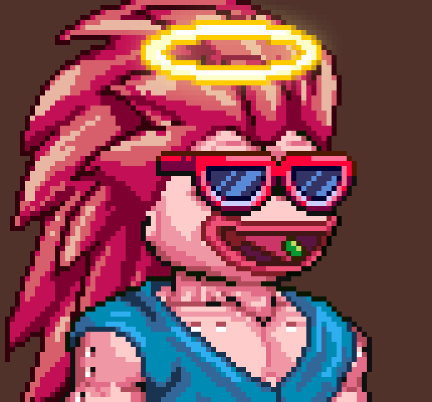

# Generative NFT Art With Rarities and Programmable Restrictions

by Diego E. Velez (Feb, 2024)

## Introduction

The `generative-art-nft-with-restrictions` repository is a library for creating generative art with a programmable restrictions feature that prevents mixing incompatible traits within the same artwork.

This enhanced version is based on a previous iteration coded by Rounak Banik, originally developed to generate NFT avatars and collectible projects. The improved version was specifically used to create the artwork for the [Pepiyans (also known as TheCarlos)](https://x.com/pepeiyans?s=20) project.

## Features (Original version legacy)

### Generate over a million distinct images with less than 60 traits

The library allows you to generate images every distinct possible combination of your traits. For context, if you had trait art for a project like [Bored Apes](https://boredapeyachtclub.com/#/home), the library could generate upwards of 1.2 billion distinct apes.

### Add rarity weights

The library also allows you to configure the image generation process in such a way that you have complete control over how rare each and every trait is.

### Generate compliant JSON metadata for your NFTs

This repository includes a functionality for generating JSON metadata for your NFTs, which is essential for most marketplaces. The original version implemented this feature in compliance with OpenSea requirements (and, by extension, the general NFT metadata standard). However, this newly enhanced version was specifically tailored to create a collection for the [WeBump](https://webump.xyz/) community using its `Lighthouse` client tool. In this updated version, both base code types of metadata are retained. Users may need to make minor adjustments to select or adapt the base metadata code according to their specific requirements.

### Fuzzy friendly

Even if you’re not familiar with programming (whether in Python or any other language), you can still utilize this library. Currently, you can refer to the tutorial for the original version: [Tutorial](https://medium.com/scrappy-squirrels/tutorial-create-generative-nft-art-with-rarities-8ee6ce843133). Additionally, a tutorial for this updated and enhanced version is currently in progress.

While the original version’s tutorial still holds some relevance for this new and improved version, I recommend focusing on the dedicated sections that highlight the new features. Take the time to explore the specific tutorials provided here to fully leverage the enhancements. Since there isn’t yet a dedicated tutorial on Medium for this enhanced version, paying close attention to the specific instructions below, in this file, is especially important.

## ENHANCED VERSION by Diego E. Velez: Feb, 29th 2024:

### Background:

While exploring resources, I stumbled upon an impressive Python codebase authored by Rounak Banik (rounakbanik). This codebase was used to generate over 3000 collection NFTs known as the [Pepiyans (AKA TheCarlos)](https://x.com/pepeiyans?s=20). The NFT images in this collection were crafted from 219 base traits spread across 8 categories, resulting in an astonishing number of possible avatars—over a billion!

However, I discovered that manipulating rarity weights using data arrays wasn’t enjoyable or efficient. Moreover, the original version lacked a crucial feature: preventing unwanted trait combinations. As a consequence, the resulting avatar images were chaotic, disorganized, and frankly unappealing. Driven by this realization, I set out to enhance the original code, and here’s what I came up with:

### RESTRICTIONS configuration (Enhanced version)

Combination rules can be established to ensure that not all traits are mixed indiscriminately. For example, we might want to avoid pairing hats with certain types of heads. To address this, I introduced the `RESTRICTIONS_CONFIG` within `restrictions.py`. Using straightforward and user-friendly Python data structures so combination rules can be easily set up.

To provide maximum assistance to users, I offer a detailed `RESTRICTIOINS_TUTORIAL.md` on how to setup `RESTRICTION_CONFIG` effectively.

### Rarity Weights in CSV files (Enhanced version)

Now it is possible to feed the rarity weights using CSV files. This feature is more convenient than using simple data arrays, especially when dealing with large numbers of traits and for users who want to experiment with different rarity weights. CSV files are more user-friendly since they can be edited with regular spreadsheets.

### Other improvements (Enhanced version)

Users can effortlessly customize the deployment folder for assets, as well as the output folder for images and metadata. All these global settings are conveniently located within the `config.py` file.

Based on a personal experience where I needed to remove zero-padding from the output images and metadata filenames, I’ve introduced a global boolean variable in `config.py` called `ZERO_PAD`. This variable acts as a switch to enable or disable zero-padding.

In this version, we’ve improved efficiency by separating trait set generation from image creation. Data cleaning now occurs within a lightweight trait dataset table, eliminating the need for computationally expensive images that would later be discarded. This change was particularly noticeable after introducing the `RESTRICTIONS_CONFIG` feature, which significantly increases the rejection rate of image trait sets that don’t comply with the specified restriction rules.

## Installation

**Clone this repository**

`git clone https://github.com/divelez69/generative-art-nft-with-restrictions.git`

**Install required packages**

`pip install Pillow pandas progressbar2`

## Configuration

**Setup initial configuration**

Begin by uploading your input assets to the `assets` folder. Next, complete the `config.py` file by carefully following the instructions provided within it. However, do not run the `python nft.py` script just yet, especially if you’re relying on CSV files to determine the rarity weights.

**Re-style PNG Trait Filenames**

PNG trait filenames in the `assets` folder must be in "Title Style". For example, a "red ape.png" trait should be renamed to "Red Ape.png". Although this requirement was not present in previous version, it has become necessary in this one because traits referenced within `RESTRICTIONS_CONFIG` must match PNG trait filenames. Unfortunately, this uncomfortable situation is an unavoidable trade-off in order to end up with beautiful and clean avatar images, thanks to the implemented restrictions configuration feature.

To re-style the PNG filenames, run the following command in your console:

`python nft.py rename`

This tool will assist you in re-styling all PNG filenames and may help you detect typos so you can correct them on the spot.

CAUTION: Once re-styled, refrain from changing the trait PNG filenames later.

**Setup Rarities**

Setup the `rarity weights`. You can simply fill up arrays for each category, but I encourage you to use CSV files. Set the value for `'rarity_weights'` to `'file'` within `config.py`, and then run `python nft.py` for the first time (please, make sure you have re-styled PNG filenames first). This will automatically create the CSVs for you. Stop the execution, so you can edit the CSVs using your preferred spreadsheet software. If needed, you can delete a CSV file and run the script again to create a new one with preloaded values.

**Setup restriction rules**

Setup the `RESTRICTIONS_CONFIG` in `restrictions.py`. This is a crucial step for defining unwanted trait combinations and ensure the production of clean and beautiful avatars. I encourage you to read the tutorial in `RESTRICTIONS_TUTORIAL.md` for further guidance.

## Production

**Generate the avatar images**

If all previous setups are done correctly, execute:

`python nft.py`

...and you'll be guided to smoothly produce the avatar images you need...

However, it's very unlikely that you'll be succesful in the first attempts. If you’ve set up restriction rules, the script may encounter mismatches, typos, or code errors in the `RESTRICTIONS_CONFIG` within the `restrictions.py` file. It’s crucial that the trait references in the `RESTRICTIONS_CONFIG` match their corresponding PNG filenames. Thankfully, you’ve already restyled the filenames by running `python nft.py rename,` so most of the typos and mismatches will fall within the `RESTRICTIONS_CONFIG`. There's no need to adhere to the "Title Style" in this data structure. The script will do its best to match, but typos will require you to fix manually.

In case, you discover typos within the PNG trait filenames that need to be fixed, be aware that correction may alter the alphabetical order. If that's the case, delete the related CSV file and run the `python nft.py` script to re-build it. Make sure to have saved any rarity weights values beforehand.

To minimize code errors while building the restrictions, please read the `RESTRICTIONS_TUTORIAL.md` carefully.

I understand that this part of the process may seem daunting and challenging. However, I encourage you to persevere. By clearly establishing the necessary trait combination restrictions, you’ll ultimately create beautiful and clean avatar images.

**JSON metadata generation**

In order to generate JSON metadata, define BASE_NAME, BASE_IMAGE_URL, and BASE_JSON in `metadata.py`. Make the necessary adjustments according to the specifications of the platform and network you chose to launch your NFTs. Then, run `python metadata.py`.

## About Pepeiyans, also known as TheCarlos

This library was created as part of the Pepeiyans (AKA TheCarlos) Project.

These funny guys are TheCarlos, and is a collection of 3.333 randomly generated NFTs on the SEI Network Blockchain. TheCarlos are meant for buyers. Last time they were seen in [Pallet](https://pallet.exchange/collection/pepeiyans) marketplace.

The community is built around learning about the NFT revolution, exploring its current use cases, discovering new applications, and finding members to collaborate on exciting projects with.

## Reference to old version:

For your reference, here are the links of the original code written by Rounak Banik

Original code repository: https://github.com/rounakbanik/generative-art-nft.git

Detailed tutorial of the original tool: [here](https://medium.com/scrappy-squirrels/tutorial-create-generative-nft-art-with-rarities-8ee6ce843133)
